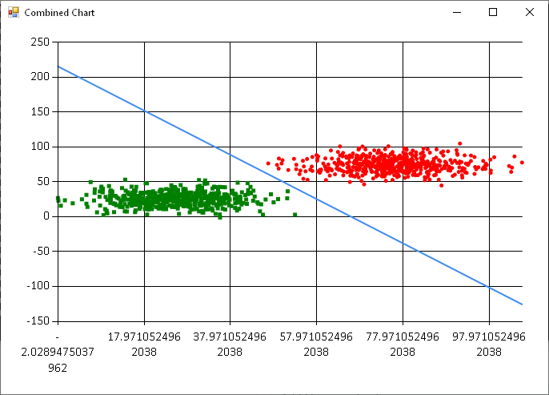

FSharpLogisticRegression
========================

This F# program is doing a (stochastic) logistic regression on two randomly generated classes in 2D.

At the end it plots the randomly generated testset with the decision boundary that was learned before. 

More explanation can be found in [my blog post](http://codingwiththomas.blogspot.com/2014/05/stochastic-logistic-regression-in-f.html).

Build Instructions
------------------

Open the solution, compile, start! Easy as this.
You'll probably need Visual Studio 2013 and .Net4.5, you can also run this on Mono. 

Note: this contains a self-patched version of the FSharp.Charting library in order to display a Window. 

License
-------

Since I am Apache committer, I consider everything inside of this repository 
licensed by Apache 2.0 license, although I haven't put the usual header into the source files.

If something is not licensed via Apache 2.0, there is a reference or an additional licence header included in the specific source file.
